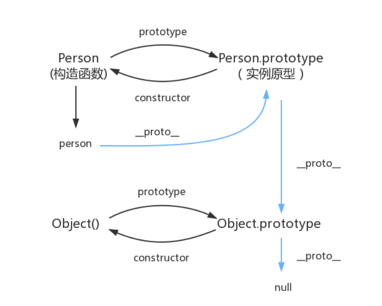

# 原型链
## 为什么会有原型链
而我们的JavaScript语言是一门基于对象的语言，它不是一门真正的面向对象编程的语言。虽然ES6提出了class编程的方式，但它终究只是一个语法糖，class编译之后其实就是一个函数。
那么在JavaScript中如何实现继承呢？这个时候就用到了原型和原型链，它们非常巧妙地解决了在JavaScript中实现**继承**的问题！

> 原型有一个相当大的作用就是，作为公共变量进行使用
通过这个就可以为，为一些不同变量（方法）添加一些公共属性

## 属性查找
原型链:当访问一个对象的属性时，如果该对象内部不存在这个属性，就会去该对象的__proto__ 上（也就是它构造函数的prototype）查找 。该构造函数的prototype上也有一个自己的__proto__ 属性，然后继续向上查找， 直到__proto__为null，就停止查找。

> 封装：将公用的方法或者组件进行封装，达到代码复用，让我们的代码更简洁
继承：子类继承父类中的实例和方法
多态：不同对象作用于同一操作产生不同的效果


## 原型 原型对象
每个函数都有prototype属性，被称作原型（显示原型）。
prototype原型指向一个对象，故也称作原型对象。

- 原型对象prototype里面有一个constructor属性，它指向了Person构造函数

## prototype和__ptoto__
很多小伙伴把prototype和__proto__混为一潭，其实这是两个维度的东西。
prototype的维度是函数，而__proto__的维度是对象。
__proto__是每个对象都有的属性，我们通常把它称为"隐式原型"，把prototype称为"显式原型"。

- 函数也是对象，函数有prototype和__proto__两个属性，而对象只有__proto__属性 

>  [ [prototype] ] 其实就是隐式原型__proto__，因为各大浏览器厂家不同，所以取了别名罢了，大家只需记住这个和__proto__一样即可。

## 原型对象的__proto__指向谁？
原型链：每个构造函数都有一个原型对象，原型对象都包含一个指向构造函数的指针，而实例都包含一个指向原型对象的内部指针。那么假如我们让原型对象等于另一个类型的实例，结果会怎样？显然，此时的原型对象将包含一个指向另一个原型的指针，相应地，另一个原型中也包含着一个指向另一个构造函数的指针。假如另一个原型又是另一个类型的实例，那么上述关系依然成立。如此层层递进，就构成了实例与原型的链条。

>每个构造函数都有一个原型对象，原型对象都包含一个指向构造函数的指针，而实例都包含一个指向原型对象的内部指针。那么假如我们让原型对象等于另一个类型的实例，结果会怎样？显然，此时的原型对象将包含一个指向另一个原型的指针，相应地，另一个原型中也包含着一个指向另一个构造函数的指针。假如另一个原型又是另一个类型的实例，那么上述关系依然成立。如此层层递进，就构成了实例与原型的链条。这就是所谓的原型链的基本概念。——摘自《javascript高级程序设计》

- 其实原型对象就是通过 Object 构造函数生成的，结合之前所讲，实例的 proto 指向构造函数的 prototype



原型链，也就是蓝色的这条线。

## 构造函数创建实例对象

```
var objectName = new functionName(args);
```

## 创建构造函数

```
var computer = new Object();
```

### new过程详解

在new一个实例对象的时候，其实它做了以下操作

1. 创建一个空对象
2. 将空对象的原型链指向构造函数的原型链
3. 执行构造函数，将this绑定到空对象上
4. 根据构造函数的返回值做判断，若是原始数据则忽略，若是对象的话则正常返回处理

```js
function myNew(fn,...args){
	//创建一个空对象
	let obj = {}
	//将obj的原型指向构造函数的原型
	obj.__proto__ = fn.prototype;
	//将构造函数的this指向obj，并且拿到构造函数返回值
	let res = Fn.apply(obj,args)
	//判断构造函数返回值类型，决定new构造出来的实例对象的值
	return res instanceof Object ? res:obj
}

```

### 构造函数可以有返回值

在JavaScript中，构造函数可以有返回值，且返回值的类型可以是任何类型，包括undefined、普通值和对象。默认情况下，构造函数会返回一个新的对象，如果构造函数返回了一个非undefined的值（包括null），则该值将替代原始的对象。
