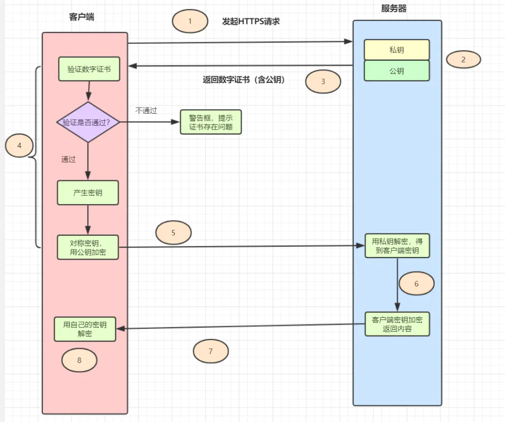

# HTTPS

## 1 HTTP 与 HTTPS 的区别。
HTTP，即超文本传输协议，是一个基于TCP/IP通信协议来传递明文数据的协议。HTTP会存在这几个问题：

- 请求信息是明文传输，容易被窃听截取。
- 没有验证对方身份，存在被冒充的风险
- 数据的完整性未校验，容易被中间人篡改
- 为了解决Http存在的问题，Https出现啦。

Https是什么？

HTTPS= HTTP+SSL/TLS，可以理解Https是身披SSL(Secure Socket Layer，安全套接层)的HTTP。

|              |  http  |    https     |
| :----------: | :----: | :----------: |
|    安全性    | 不安全 |     安全     |
|   默认端口   |   80   |     443      |
|   资源消耗   |  较少  | 资源消耗较多 |
| 是否需要证书 | 不需要 |     需要     |
| 报文是否加密 |  明文  |     密文     |

## 2 Https流程是怎样的？
- HTTPS = HTTP + SSL/TLS，也就是用SSL/TLS对数据进行加密和解密，Http进行传输。
- SSL，即Secure Sockets Layer（安全套接层协议），是网络通信提供安全及数据完整性的一种安全协议。
- TLS，即Transport Layer Security(安全传输层协议)，它是SSL3.0的后续版本。

1. 客户端发起Https请求，连接到服务器的443端口。
2. 服务器必须要有一套数字证书（证书内容有公钥、证书颁发机构、失效日期等）。
3. 服务器将自己的数字证书发送给客户端（公钥在证书里面，私钥由服务器持有）。
4. 客户端收到数字证书之后，会验证证书的合法性。如果证书验证通过，就会生成一个随机的对称密钥，用证书的公钥加密。
5. 客户端将公钥加密后的密钥发送到服务器。
6. 服务器接收到客户端发来的密文密钥之后，用自己之前保留的私钥对其进行非对称解密，解密之后就得到客户端的密钥，然后用客户端密钥对返回数据进行对称加密，传输的数据都是密文啦。
7. 服务器将加密后的密文返回到客户端。
8. 客户端收到后，用自己的密钥对其进行对称解密，得到服务器返回的数据。